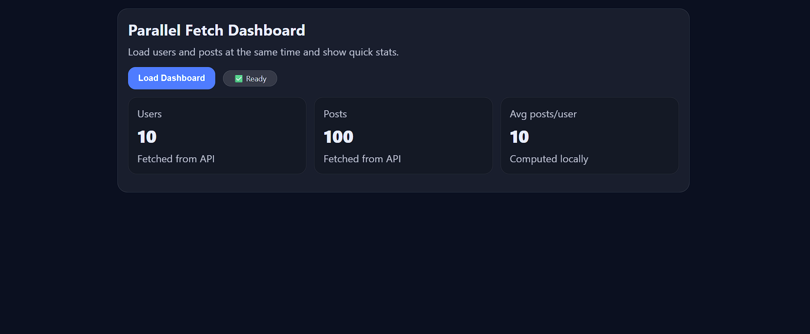

# Parallel Dashboard

A simple dashboard that loads users and posts from two API endpoints **in parallel** using `Promise.all()` and displays quick statistics.

## Screenshot

## Features

- Fetch multiple APIs in parallel to improve loading speed
- Parse JSON responses in parallel
- Calculate simple statistics:
  - Total users
  - Total posts
  - Average posts per user
- Clean UI state management:
  - Loading spinner
  - Status pill (Idle → Loading → Ready/Error)
  - Error messages displayed only when needed
- Responsive and modern dashboard design

## Technologies

- HTML, CSS, JavaScript
- Fetch API with `Promise.all()` and `async/await`

## Usage

1. Open `index.html` in your browser.
2. Click **Load Dashboard** to fetch data and display statistics.
3. See live updates in the UI.

## Author

CodeWithKamikaze
